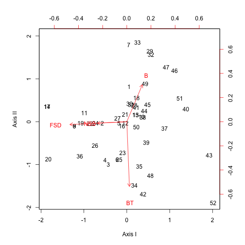
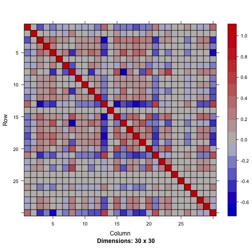

lme4ord (l-m-e-ford)
====================


Mixed-effects models for community ecologists.  See the currently
evolving [mission statement](https://github.com/stevencarlislewalker/lme4ord/issues/1).

This package is not at all stable.


```r
library(Matrix)
library(lme4ord)
library(plotrix)
library(minqa)
library(ape)
library(lme4)
library(lme4pureR)
library(multitable)
library(pryr)
library(reo)
```

#### phylogenetic generalized linear mixed models!

Begin with initial simulations of a sites-by-species binary response
matrix, `y`, environmental variable, `x`, and trait `z`.
stronger correlations between `y` and `x` will be added below.

```r
set.seed(10)
n <- 10
m <- 30
dl <- dims_to_vars(data.list(y = 1 * (rmat(n, m) > 0),
                             x = rnorm(n), z = rnorm(m),
                             dimids = c("sites", "species")))
df <- as.data.frame(dl)
head(df)
```

```
##       y          x         z sites species
## 01.01 1  1.5025446 0.5115965    01      01
## 02.01 0  0.5904095 0.5115965    02      01
## 03.01 0 -0.6306855 0.5115965    03      01
## 04.01 0  0.7923495 0.5115965    04      01
## 05.01 1  0.1253846 0.5115965    05      01
## 06.01 1  0.3227550 0.5115965    06      01
```

Make up some silly phylogeny.

```r
phy <- rtree(n = m)
phy <- compute.brlen(phy, method = "Grafen", power = 0.5)
```
and estimate a phylogenetic covariance matrix, standardized to unit determinant.

```r
Vphy <- stanCov(vcv(phy))
dimnames(Vphy) <- rep(list(1:m), 2)
```
Here's the phylogeny (forget the species names) and the associated covariance matrix

```r
plot(phy)
```

 

```r
image(as(Vphy, "sparseMatrix"))
```

 
Put the covariance matrix in a list, for model-input purposes -- the
idea is that there might be other covariance matrix (e.g. a spatial
one say).  It is important that the list element gets the name
`species` because this is the name of the grouping factor used in the
model formula below.

```r
covList <- list(species = Vphy)
```

Here is the cool part ... a formula interface.  This model has a fixed
interaction between the environment and the trait (with intercept and
main effects too), a random environmental slope and intercept with
phylogenetic correlations across species.  However, the phylogenetic
nature of the covariances is not set in the formula, but rather as an
argument to the `levelsCovFormula` function below, which will form the
formula parsing module of a pglmer function.

```r
form <- y ~ x*z + (x | species)
parsedForm <- levelsCovFormula(form, df, covList = covList)
```

Set the covariance parameters to something more interesting (i.e. with
a covariance between the slope and intercept).

```r
covarSim <- c(0.5, -0.2, 0.5)
parsedForm <- within(parsedForm, Lambdat@x[] <- mapToCovFact(covarSim))
```
Update the simulations to reflect the new structure.

```r
X <- model.matrix(nobars(form), df) # fixed effects design matrix
Z <- t(parsedForm$Lambdat %*% parsedForm$Zt) # random effects design
                                             # matrix with
                                             # phylogenetic
                                             # covariances
fixefSim <- rnorm(ncol(X)) # fixed effects
u <- rnorm(ncol(Z)) # whitened random effects
p <- plogis(as.numeric(X %*% fixefSim + Z %*% u)) # probability of observation
dl$y <- rbinom(nrow(df), 1, p) # presence-absence data
df <- as.data.frame(dl) # reconstruct the data frame with new
                        # structured response
```
Now we look at the new structure.  Here's the Cholesky factor of the species covariance, and the covariance itself.

```r
image(parsedForm$Lambdat)
```

 

```r
image(crossprod(parsedForm$Lambdat))
```

 
The big four blocks represent the 2-by-2 covariance between intercept
and slope.  The covariances within these blocks represent phylogenetic
covariance.  the pattern here is more closely related species have
more similar intercepts and slopes (red blocks on the diagonal) but
more closely related species also have stronger negative correlations
between slope and intercept (blue blocks on off diagonal).

Here's the transposed random effects model matrix.  Those are 1's for
the intercepts in the first 30 rows and the environmental variable in
the second 30.

```r
image(parsedForm$Zt)
```

 

Here's the full covariance matrix (the large scale blocks reflect
phylogenetic correlations and the patterns within each block are due
to the environmental variable).

```r
image(fullCov <- t(parsedForm$Zt) %*% crossprod(parsedForm$Lambdat) %*% parsedForm$Zt)
```

 
Here's a closeup of one of the blocks

```r
image(fullCov[1:10, 1:10])
```

 
A potential problem is that this block is singular.

```r
eigen(fullCov[1:10, 1:10])$values
```

```
##  [1]  6.748128e+00  3.398358e+00  1.561011e-16  1.101625e-16  6.591610e-18
##  [6] -3.885041e-17 -8.128315e-17 -3.923051e-16 -4.882623e-16 -6.122015e-16
```
In fact the rank of the full 300 by 300 matrix is only 60 = 30 species
times 2 model matrix columns.

```r
rankMatrix(fullCov)[1]
```

```
## [1] 60
```
But then again so is the standard non-phylogenetic `glmer` model.

```r
gm <- glmer(form, df, binomial)
with(getME(gm, c("Zt", "Lambdat")), {
    covMatGm <- t(Zt) %*% crossprod(Lambdat) %*% Zt
    print(rankMatrix(covMatGm)[1])
    dim(covMatGm)
})
```

```
## [1] 60
```

```
## [1] 300 300
```
The distribution of underlying probabilities of occurrence looks OK.

```r
hist(p)
```

 
Here is the observed occurrence pattern.

```r
color2D.matplot(dl$y, xlab = "species", ylab = "sites", main = "abundance")
```

 

Now we set the initial values for the optimization.

```r
parInds <- list(covar = 1:3, fixef = 4:7, loads = NULL)
initPars <- c(covar = c(1, 0, 1), fixef = rep(0, 4))
```
The `parInds` `list` points to the indices in `initPars` containing
different pieces of the parameter vector.  The `covar` parameters give
the parameters influencing phylogenetic covariances between slopes and
intercepts.  The `fixef` parameters give the coefficients of the fixed
effects.  The `loads` parameters are absent, because in this model we
do not fit factor loadings.

We construct the deviance function out of all these pieces.

```r
dfun <- mkGeneralGlmerDevfun(df$y, parsedForm$X,
                             parsedForm$Zt, parsedForm$Lambdat,
                             rep(1, nrow(df)), rep(0, nrow(df)),
                             initPars, parInds,
                             parsedForm$mapToCovFact, function(loads) NULL)
```
Try out one evaluation of the deviance function.

```r
dfun(initPars)
```

```
## [1] 342.7135
```
Looks OK so we optimize.

```r
opt <- bobyqa(initPars, dfun, lower = c(0, -Inf, 0, rep(-Inf, 4)),
              control = list(iprint = 4L))
```

```
## npt = 9 , n =  7 
## rhobeg =  0.2 , rhoend =  2e-07 
##    0.020:  16:      326.108;0.913041 -0.00778830 0.234334 -0.00649153 0.0534229 -0.00649039 0.802518 
##   0.0020:  52:      324.062;0.810136 -0.212125 0.311686 -0.477415 -0.147567 0.0725226 0.797887 
##  0.00020: 112:      323.505;0.775431 -0.153499 0.284980 -0.766786 0.0162808 0.0618667 0.823171 
##  2.0e-05: 150:      323.504;0.778212 -0.156232 0.288580 -0.779003 0.0208195 0.0617865 0.823439 
##  2.0e-06: 164:      323.504;0.778192 -0.156208 0.288498 -0.778952 0.0208564 0.0616325 0.823370 
##  2.0e-07: 181:      323.504;0.778198 -0.156207 0.288496 -0.778968 0.0208562 0.0616380 0.823377 
## At return
## 197:     323.50387: 0.778198 -0.156207 0.288495 -0.778968 0.0208559 0.0616375 0.823378
```

```r
names(opt$par) <- names(initPars)
```
and compare with the true parameter values.

```r
cbind(estimated = opt$par, # estimated parameters
      true = c(covar = covarSim, fixef = fixefSim)) # true parameters
```

```
##          estimated        true
## covar1  0.77819762  0.50000000
## covar2 -0.15620693 -0.20000000
## covar3  0.28849496  0.50000000
## fixef1 -0.77896847 -1.13324675
## fixef2  0.02085585  0.06607030
## fixef3  0.06163753  0.03799977
## fixef4  0.82337750  0.92106475
```
Looks great!  At least in this case.

#### mixed effects ordination!


```r
data(fish)
data(limn)
Y <- as.matrix(fish)
## Y <- Y[, colSums(Y) > 1]
n <- nrow(Y)
m <- ncol(Y)
x <- as.vector(scale(limn$pH))
dl <- data.list(Y = t(Y), x = x,
                dimids = c("species", "sites"))
summary(dl)
```

```
##            Y     x
## species TRUE FALSE
## sites   TRUE  TRUE
```

```r
mod <- gblmer(Y ~ 1 + (1 | species), . ~ 0 + (0 + latent | sites),
              dl, binomial, 1, 1, 2)
```

```
## Error in gblmer(Y ~ 1 + (1 | species), . ~ 0 + (0 + latent | sites), dl, : data must be a data list
```

```r
mod
```

```
## Error in eval(expr, envir, enclos): object 'mod' not found
```

```r
ranef(mod)$species
```

```
## Error in ranef(mod): object 'mod' not found
```

```r
ranef(mod)$sites
```

```
## Error in ranef(mod): object 'mod' not found
```

```r
(loadMod <- loadings(mod))
```

```
## Error in loadings(mod): object 'mod' not found
```

```r
latentCov <- Matrix(loadMod %*% t(loadMod)) + diag(VarCorr(mod)$species[1], m, m)
```

```
## Error in is(data, "Matrix"): object 'loadMod' not found
```

```r
image(cov2cor(latentCov))
```

```
## Error in image(cov2cor(latentCov)): error in evaluating the argument 'x' in selecting a method for function 'image': Error in cov2cor(latentCov) : 
##   error in evaluating the argument 'V' in selecting a method for function 'cov2cor': Error: object 'latentCov' not found
```

```r
fitY <- matrix(getME(mod, "mu"), n, m, byrow = TRUE)
```

```
## Error in is(object, "merMod"): object 'mod' not found
```

```r
boxplot(fitY ~ Y, las = 1, horizontal = TRUE)
```

```
## Error in eval(expr, envir, enclos): object 'fitY' not found
```

#### Short demo

We need these packages (and their dependencies),

```r
library("lme4")
library("lme4ord")
library("Matrix")
library("reo") ## install.packages("reo", repos="http://R-Forge.R-project.org")
```
Prepare some data,

```r
Y <- Yp <-  as.matrix(fish)
Y <- Y[order(rowSums(Y)), ]
Yp <- Yp[order(rowSums(Yp)), ]
```
FIXME:  use more standard data set in more standard package.

Construct deviance functions for one and two axis ordination models,

```r
dfun1 <- logisticPcaDevfun(Yp, 1)
```

```
## Note: method with signature 'Matrix#diagonalMatrix' chosen for function 'kronecker',
##  target signature 'dgCMatrix#ddiMatrix'.
##  "sparseMatrix#ANY" would also be valid
## Note: method with signature 'dsparseMatrix#dsparseMatrix' chosen for function 'kronecker',
##  target signature 'dgCMatrix#dtTMatrix'.
##  "sparseMatrix#TsparseMatrix" would also be valid
```

```r
dfun2 <- logisticPcaDevfun(Yp, 2)
```
Get starting values for the optimization of these deviance functions,

```r
pars1 <- unlist(as.list(environment(dfun1))[c("theta", "phi")])[-1]
pars2 <- unlist(as.list(environment(dfun2))[c("theta", "phi")])[-1]
```
Optimize these deviance functions,

```r
opt1 <- optim(pars1, dfun1, method = "BFGS",
              control = list(maxit = 500, trace = TRUE))
```

```
## initial  value 1261.432956 
## iter  10 value 1169.299947
## iter  20 value 1168.688341
## iter  30 value 1168.118807
## iter  40 value 1167.438431
## final  value 1167.329338 
## converged
```

```r
opt2 <- optim(pars2, dfun2, method = "BFGS",
              control = list(maxit = 500, trace = TRUE))
```

```
## initial  value 1189.855260 
## iter  10 value 1105.507937
## iter  20 value 1102.367337
## iter  30 value 1101.121497
## iter  40 value 1099.596968
## iter  50 value 1098.988855
## iter  60 value 1098.701727
## iter  70 value 1098.460386
## iter  80 value 1098.395093
## iter  90 value 1098.384686
## iter  90 value 1098.384685
## final  value 1098.383082 
## converged
```
Both models seem to both converge,

```r
opt1$convergence
```

```
## [1] 0
```

```r
opt2$convergence
```

```
## [1] 0
```

FIXME:  However for the two-axis model, while it gets close quickly, takes hundreds of iterations zeroing in on a solution.  Is this a quasi-convex problem?  That is, is it just skating around on a fairly flat part of the deviance function?  Perhaps we could get a speed up with some kind of penalty?


We make easier to understand objects from the results,

```r
mod1 <- mkMod(environment(dfun1), opt1)
mod2 <- mkMod(environment(dfun2), opt2)
```

Let's plot some results from the two-axis model.  First we plot a series of image plots of observed and fitted site-by-species matrices.  These plots provide a decomposition of the sources of variation in the observed sites by species matrix (FIXME: add residual plot too).

```r
plotimage <- function(mat, ...)
    image(1:nrow(mat), 1:ncol(mat), mat, las = 1,
          zlim = c(0, 1),
          col = grey(seq(1, 0, length = 100)),
          ...)
par(mfrow = c(1, 6))
plotimage(Yp, main = "data")
plotimage(plogis(mod2$fit),
          main = "fitted values")
plotimage(plogis(mod2$fitInter),
          main = "intercept")
plotimage(plogis(mod2$fitAxes),
          main = "site-species interactions")
plotimage(plogis(mod2$fitRow),
          main = "main site effect")
plotimage(plogis(mod2$fitCol),
          main = "main species effect")
```

 

Now we make a logit-scale biplot (with only a few species to reduce clutter),

```r
par(mfrow = c(1, 1))
rowKeep <- apply(abs(mod2$rowScores) > 0, 1, any)
colKeep <- apply(abs(mod2$colScores) > 0.3, 1, any)
biplot(mod2$rowScores[rowKeep,c(1, 2)], mod2$colScores[colKeep,c(1, 2)],
       xlabs = (1:52)[rowKeep], ylabs = colnames(Yp)[colKeep],
       xlab = "Axis I", ylab = "Axis II")
```

 

Note that the two kinds of bass (smallmouth, SB, and largemouth, LB) are orthogonal, indicating that they are relatively uncorrelated.  On the other hand, northern redbelly dace, NRD, is negatively correlated with largemouth.

We can also plot the covariance matrix among species of the latent variables,

```r
image(cov2cor(mod2$typeCors))
```

 

#### TODO

Lots!  Most important things:

1. write up math
2. user interface
3. allow arbitrary family
4. find faster parameterizations
