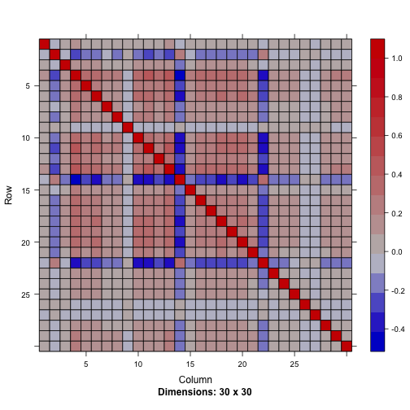
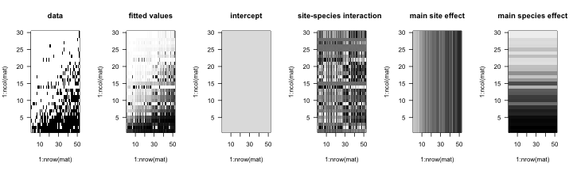

lme4ord (L.M.E.-ford)
=====================


Ecological mixed-effects ordination with lme4.  This package is not at all stable.

#### New function: gblmer


```r
library(Matrix)
```

```
## Loading required package: methods
```

```r
library(lme4ord)
```

```
## Loading required package: lme4
## Loading required package: Rcpp
## 
## Attaching package: 'lme4ord'
## 
## The following object is masked from 'package:stats':
## 
##     loadings
```

```r
library(lme4)
library(lme4pureR)
library(multitable)
library(pryr)
```

```
## Warning: package 'pryr' was built under R version 3.1.2
```

```r
library(reo)
```

```
## Loading required package: MASS
## Loading required package: vegan
## Loading required package: permute
## Loading required package: lattice
## This is vegan 2.0-10
## Loading required package: ellipse
```

```r
data(fish)
data(limn)
Y <- as.matrix(fish)
## Y <- Y[, colSums(Y) > 1]
n <- nrow(Y)
m <- ncol(Y)
x <- as.vector(scale(limn$pH))
dl <- data.list(Y = t(Y), x = x,
                dimids = c("species", "sites"))
summary(dl)
```

```
##            Y     x
## species TRUE FALSE
## sites   TRUE  TRUE
```

```r
mod <- gblmer(Y ~ 1 + (1 | species), . ~ 0 + (0 + latent | sites),
              dl, binomial, 1, 1, 2)
```

```
## npt = 33 , n =  31 
## rhobeg =  0.2 , rhoend =  2e-07 
##    0.020:  76:      1252.45;0.323300 -0.436354 0.582565  1.40716 0.911738 0.997755 0.700073 0.698841 -0.204755  1.23321  1.39934 0.860738  1.47790 -0.544400 0.687366 0.959428 0.792869  1.28714  1.09818  1.02508 0.840071 -0.463362 0.406668 0.430240 0.339764 0.0862311 0.109899 0.373868 0.475042 0.485580  1.55178 
##   0.0020: 231:      1243.71;0.250100 -0.661719 0.409452  1.62735 0.936811  1.15452 0.593951 0.617467 -0.0638832  1.28093  1.45214 0.889841  1.57534 -1.34720 0.568326 0.934150 0.921813  1.26801  1.06411  1.08994 0.746866 -1.08434 0.502023 0.438579 0.399718 -0.0750914 -0.171920 0.450475 0.559812 0.609205  1.81048 
##  0.00020: 429:      1243.57;0.250452 -0.699385 0.383311  1.67198 0.937908  1.20543 0.602429 0.646264 -0.0818152  1.29744  1.44014 0.909639  1.60520 -1.43204 0.570394 0.928802 0.955981  1.24863  1.07801  1.13584 0.727853 -1.19362 0.481724 0.414445 0.379069 -0.0987956 -0.239663 0.439707 0.571791 0.569819  1.82532 
##  2.0e-05: 617:      1243.56;0.248236 -0.703827 0.382022  1.67584 0.938087  1.21109 0.602776 0.647428 -0.0845461  1.29731  1.43943 0.913488  1.60647 -1.43614 0.570291 0.925997 0.961047  1.24567  1.07824  1.13889 0.725761 -1.19591 0.480794 0.412084 0.376535 -0.0985006 -0.243705 0.438888 0.568520 0.568321  1.82578 
##  2.0e-06: 789:      1243.56;0.248216 -0.704019 0.381956  1.67606 0.938061  1.21142 0.602714 0.647495 -0.0848472  1.29714  1.43931 0.913618  1.60642 -1.43639 0.570233 0.925722 0.961377  1.24514  1.07824  1.13935 0.725334 -1.19587 0.480395 0.411651 0.376560 -0.0981889 -0.244264 0.438582 0.568095 0.568113  1.82581 
##  2.0e-07: 917:      1243.56;0.248212 -0.704038 0.381959  1.67607 0.938054  1.21144 0.602717 0.647500 -0.0848598  1.29713  1.43930 0.913618  1.60642 -1.43638 0.570224 0.925693 0.961399  1.24512  1.07824  1.13938 0.725314 -1.19582 0.480383 0.411652 0.376568 -0.0981682 -0.244296 0.438564 0.568077 0.568098  1.82581 
## At return
## 965:     1243.5646: 0.248212 -0.704038 0.381960  1.67607 0.938054  1.21144 0.602718 0.647499 -0.0848598  1.29713  1.43930 0.913619  1.60642 -1.43638 0.570225 0.925692 0.961399  1.24512  1.07824  1.13938 0.725313 -1.19582 0.480382 0.411651 0.376568 -0.0981670 -0.244296 0.438563 0.568078 0.568098  1.82581
```

```r
mod
```

```
## Generalized linear mixed model fit by maximum likelihood (Adaptive
##   Gauss-Hermite Quadrature, nAGQ = 0) [gblmerMod]
##  Family: binomial  ( logit )
##       AIC       BIC    logLik  deviance  df.resid 
## 1249.5646 1265.6220 -621.7823 1243.5646      1557 
## Random effects:
##  Groups  Name        Std.Dev.
##  sites   latent      1.000   
##  species (Intercept) 1.826   
## Number of obs: 1560, groups:  sites, 52; species, 30
## Fixed Effects:
## (Intercept)  
##      -1.577
```

```r
ranef(mod)$species
```

```
##     (Intercept)
## B    -0.1443291
## BB    2.3571204
## BD   -1.1312665
## BM   -1.8960903
## BNM   0.4085210
## BNS   0.1416183
## BS   -0.8797312
## BT    0.8332210
## C    -1.6364386
## CC    3.1203070
## CS    0.2190233
## FF   -1.5083633
## FM   -0.3042268
## FSD  -0.2871194
## GS    1.2751559
## ID   -1.0731955
## LB   -0.2483744
## LC   -1.2148331
## LT   -0.6463026
## LW   -2.0418821
## M    -1.9145723
## NRD   1.1957483
## NSS  -2.0418921
## PD    0.2341424
## PS    3.4502207
## RB   -1.1873412
## RS   -1.9850110
## SB    0.7460983
## WS    2.8308109
## YP    3.3289819
```

```r
ranef(mod)$sites
```

```
##                   latent
## 3 Island     -0.09661627
## Austin       -1.24853280
## Bear          0.39158229
## Bentshoe     -0.68397739
## Big East     -0.16211956
## Big Orillia  -1.76478479
## Bloody        1.59505195
## Blue Chalk    1.03109454
## Brady        -0.72280098
## Buchanan      0.94559608
## Cinder       -0.26756444
## Clayton      -0.51553729
## Crosson      -0.01683427
## Dan          -0.16211956
## Ernest       -0.31064464
## Fletcher      1.02755306
## Grindstone   -1.28745320
## Gullfeather  -0.76950764
## Harvey        0.77893323
## Herb         -0.33160282
## Jill         -1.58364886
## Kawagama      1.74164850
## Kimball       1.11506059
## L.Fletcher    1.20424292
## L.Louie       0.87532660
## L.Orillia    -1.76478479
## L.Troutspawn  0.87890363
## L.Wren       -0.00864562
## Livingstone   1.36433213
## Louie         1.04781782
## McDonald      0.19314827
## McFadden      1.30770547
## McKeown      -0.30443996
## Millichamp    0.82299815
## Poker         0.18576454
## Poorhouse     1.51378936
## Porcupine    -1.03698834
## Raven         1.03748185
## Redchalk      2.30796520
## Ridout        0.28953734
## S.McDonald   -0.03509664
## Saucer       -1.58364886
## Shoe         -0.80071054
## South Jean   -0.46007407
## Sugarbowl    -1.13299519
## Sunken       -1.09068325
## Teapot       -2.02670593
## Tingey       -1.26271249
## Troutspawn    1.46763233
## Wolf         -0.44567672
## Wren          0.44811419
## Wrist        -0.40545538
```

```r
(loadMod <- loadings(mod))
```

```
##  [1]  0.24821172 -0.70403807  0.38196046  1.67606974  0.93805413
##  [6]  1.21143611  0.60271771  0.64749920 -0.08485984  1.29712942
## [11]  1.43929663  0.91361862  1.60642435 -1.43638031  0.57022500
## [16]  0.92569235  0.96139948  1.24512383  1.07824433  1.13937821
## [21]  0.72531328 -1.19581669  0.48038188  0.41165098  0.37656840
## [26] -0.09816696 -0.24429579  0.43856340  0.56807761  0.56809820
```

```r
latentCov <- Matrix(loadMod %*% t(loadMod)) + diag(VarCorr(mod)$species[1], m, m)
image(cov2cor(latentCov))
```

 

```r
fitY <- matrix(getME(mod, "mu"), n, m, byrow = TRUE)
boxplot(fitY ~ Y, las = 1, horizontal = TRUE)
```

 

#### Short demo

We need these packages (and their dependencies),

```r
library("lme4")
library("lme4ord")
library("Matrix")
library("reo") ## install.packages("reo", repos="http://R-Forge.R-project.org")
```
Prepare some data,

```r
Y <- Yp <-  as.matrix(fish)
Y <- Y[order(rowSums(Y)), ]
Yp <- Yp[order(rowSums(Yp)), ]
```
FIXME:  use more standard data set in more standard package.

Construct deviance functions for one and two axis ordination models,

```r
dfun1 <- logisticPcaDevfun(Yp, 1)
```

```
## Note: method with signature 'Matrix#diagonalMatrix' chosen for function 'kronecker',
##  target signature 'dgCMatrix#ddiMatrix'.
##  "sparseMatrix#ANY" would also be valid
## Note: method with signature 'dsparseMatrix#dsparseMatrix' chosen for function 'kronecker',
##  target signature 'dgCMatrix#dtTMatrix'.
##  "sparseMatrix#TsparseMatrix" would also be valid
```

```r
dfun2 <- logisticPcaDevfun(Yp, 2)
```
Get starting values for the optimization of these deviance functions,

```r
pars1 <- unlist(as.list(environment(dfun1))[c("theta", "phi")])[-1]
pars2 <- unlist(as.list(environment(dfun2))[c("theta", "phi")])[-1]
```
Optimize these deviance functions,

```r
opt1 <- optim(pars1, dfun1, method = "BFGS",
              control = list(maxit = 500, trace = TRUE))
```

```
## initial  value 1261.432956 
## iter  10 value 1169.299947
## iter  20 value 1168.688341
## iter  30 value 1168.118807
## iter  40 value 1167.438431
## final  value 1167.329338 
## converged
```

```r
opt2 <- optim(pars2, dfun2, method = "BFGS",
              control = list(maxit = 500, trace = TRUE))
```

```
## initial  value 1189.855260 
## iter  10 value 1105.507937
## iter  20 value 1102.367337
## iter  30 value 1101.121497
## iter  40 value 1099.596968
## iter  50 value 1098.988855
## iter  60 value 1098.701727
## iter  70 value 1098.460386
## iter  80 value 1098.395093
## iter  90 value 1098.384686
## iter  90 value 1098.384685
## final  value 1098.383082 
## converged
```
Both models seem to both converge,

```r
opt1$convergence
```

```
## [1] 0
```

```r
opt2$convergence
```

```
## [1] 0
```

FIXME:  However for the two-axis model, while it gets close quickly, takes hundreds of iterations zeroing in on a solution.  Is this a quasi-convex problem?  That is, is it just skating around on a fairly flat part of the deviance function?  Perhaps we could get a speed up with some kind of penalty?


We make easier to understand objects from the results,

```r
mod1 <- mkMod(environment(dfun1), opt1)
mod2 <- mkMod(environment(dfun2), opt2)
```

Let's plot some results from the two-axis model.  First we plot a series of image plots of observed and fitted site-by-species matrices.  These plots provide a decomposition of the sources of variation in the observed sites by species matrix (FIXME: add residual plot too).

```r
plotimage <- function(mat, ...)
    image(1:nrow(mat), 1:ncol(mat), mat, las = 1,
          zlim = c(0, 1),
          col = grey(seq(1, 0, length = 100)),
          ...)
par(mfrow = c(1, 6))
plotimage(Yp, main = "data")
plotimage(plogis(mod2$fit),
          main = "fitted values")
plotimage(plogis(mod2$fitInter),
          main = "intercept")
plotimage(plogis(mod2$fitAxes),
          main = "site-species interactions")
plotimage(plogis(mod2$fitRow),
          main = "main site effect")
plotimage(plogis(mod2$fitCol),
          main = "main species effect")
```

 

Now we make a logit-scale biplot (with only a few species to reduce clutter),

```r
par(mfrow = c(1, 1))
rowKeep <- apply(abs(mod2$rowScores) > 0, 1, any)
colKeep <- apply(abs(mod2$colScores) > 0.3, 1, any)
biplot(mod2$rowScores[rowKeep,c(1, 2)], mod2$colScores[colKeep,c(1, 2)],
       xlabs = (1:52)[rowKeep], ylabs = colnames(Yp)[colKeep],
       xlab = "Axis I", ylab = "Axis II")
```

 

Note that the two kinds of bass (smallmouth, SB, and largemouth, LB) are orthogonal, indicating that they are relatively uncorrelated.  On the other hand, northern redbelly dace, NRD, is negatively correlated with largemouth.

We can also plot the covariance matrix among species of the latent variables,

```r
image(cov2cor(mod2$typeCors))
```

 

#### TODO

Lots!  Most important things:

1. write up math
2. user interface
3. allow arbitrary family
4. find faster parameterizations
