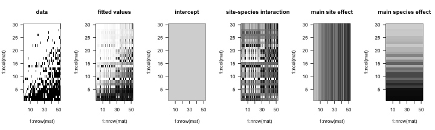

lme4ord
=======

Ecological mixed-effects ordination with lme4.  This package is not at all stable.

#### Short demo

We need these packages (and their dependencies),

```r
library("lme4")
```

```
## Loading required package: Matrix
## Loading required package: methods
## Loading required package: Rcpp
```

```r
library("lme4ord")
library("Matrix")
library("reo") ## install.packages("reo", repos="http://R-Forge.R-project.org")
```

```
## Loading required package: MASS
## Loading required package: vegan
## Loading required package: permute
## Loading required package: lattice
## This is vegan 2.0-10
## Loading required package: ellipse
```
Prepare some data,

```r
Y <- Yp <-  as.matrix(fish)
Y <- Y[order(rowSums(Y)), ]
Yp <- Yp[order(rowSums(Yp)), ]
```
FIXME:  use more standard data set in more standard package.

Construct deviance functions for one and two axis ordination models,

```r
dfun1 <- logisticPcaDevfun(Yp, 1)
```

```
## Note: method with signature 'Matrix#diagonalMatrix' chosen for function 'kronecker',
##  target signature 'dgCMatrix#ddiMatrix'.
##  "sparseMatrix#ANY" would also be valid
## Note: method with signature 'dsparseMatrix#dsparseMatrix' chosen for function 'kronecker',
##  target signature 'dgCMatrix#dtTMatrix'.
##  "sparseMatrix#TsparseMatrix" would also be valid
```

```r
dfun2 <- logisticPcaDevfun(Yp, 2)
```
Get starting values for the optimization of these deviance functions,

```r
pars1 <- unlist(as.list(environment(dfun1))[c("theta", "phi")])[-1]
pars2 <- unlist(as.list(environment(dfun2))[c("theta", "phi")])[-1]
```
Optimize these deviance functions,

```r
(opt1 <- optim(pars1, dfun1, method = "BFGS",
               control = list(maxit = 500, trace = TRUE)))
```

```
## initial  value 1325.538069 
## iter  10 value 1218.152643
## iter  20 value 1210.485369
## iter  30 value 1209.980552
## final  value 1209.979107 
## converged
```

```
## $par
##   theta2   theta3     phi1     phi2     phi3     phi4     phi5     phi6 
## -0.29581  1.00000  0.07317  1.76878  0.23877 -1.79694 -1.00011 -4.44046 
##     phi7     phi8     phi9    phi10    phi11    phi12    phi13    phi14 
## -0.57175 -1.10880  1.07607 -1.12867 -0.80293 -2.62631 -1.44391  3.62983 
##    phi15    phi16    phi17    phi18    phi19    phi20    phi21    phi22 
## -0.21751 -0.17868 -3.07928 -0.42625 -1.05684 -1.76395  0.18100  1.89888 
##    phi23    phi24    phi25    phi26    phi27    phi28    phi29    phi30 
## -0.01454  0.37915  0.05665 -0.04070  0.74375 -0.19298  0.09923  0.09923 
## 
## $value
## [1] 1210
## 
## $counts
## function gradient 
##       69       36 
## 
## $convergence
## [1] 0
## 
## $message
## NULL
```

```r
(opt2 <- optim(pars2, dfun2, method = "BFGS",
               control = list(maxit = 500, trace = TRUE)))
```

```
## initial  value 1310.689060 
## iter  10 value 1199.212766
## iter  20 value 1162.981919
## iter  30 value 1156.772503
## iter  40 value 1153.923730
## iter  50 value 1152.482015
## iter  60 value 1152.124573
## iter  70 value 1151.854097
## iter  80 value 1151.539814
## iter  90 value 1151.003893
## iter 100 value 1150.821982
## iter 110 value 1150.547675
## iter 120 value 1150.169351
## iter 130 value 1149.892214
## iter 140 value 1149.430677
## iter 150 value 1149.059880
## iter 160 value 1148.729508
## iter 170 value 1148.098506
## iter 180 value 1146.965068
## iter 190 value 1145.995145
## iter 200 value 1145.433023
## iter 210 value 1144.962630
## iter 220 value 1144.398968
## iter 230 value 1143.721513
## iter 240 value 1142.985435
## iter 250 value 1141.899790
## iter 260 value 1141.470784
## iter 270 value 1140.967593
## iter 280 value 1140.697408
## iter 290 value 1140.539473
## iter 300 value 1140.373883
## final  value 1138.745479 
## converged
```

```
## $par
##     theta2     theta3       phi1       phi2       phi3       phi4 
## -2.259e+01  1.000e+00 -5.828e-01 -1.326e+00 -9.161e-04  1.544e+00 
##       phi5       phi6       phi7       phi8       phi9      phi10 
##  9.756e-01  3.069e+00  4.712e-01  5.568e-01  1.881e+01  1.066e+00 
##      phi11      phi12      phi13      phi14      phi15      phi16 
##  1.159e+00  1.439e+00  2.032e+00 -3.048e+00  3.514e-01  8.046e+00 
##      phi17      phi18      phi19      phi20      phi21      phi22 
##  1.873e+00  2.942e+00  2.208e+00  1.594e+00  2.348e+00 -1.167e+00 
##      phi23      phi24      phi25      phi26      phi27      phi28 
##  8.556e-01  1.260e+00  3.731e-01  1.879e-01 -1.864e-01  4.987e-01 
##      phi29      phi30      phi31      phi32      phi33      phi34 
##  1.265e+00  1.265e+00 -1.469e+00 -3.587e-01  7.248e-01  4.228e-01 
##      phi35      phi36      phi37      phi38      phi39      phi40 
##  3.062e+00  6.699e-02  7.580e-01 -5.170e+01  4.045e-01  3.843e-02 
##      phi41      phi42      phi43      phi44      phi45      phi46 
##  1.614e+00  3.728e-01 -9.869e-01 -9.676e-02 -5.411e+00  2.249e+00 
##      phi47      phi48      phi49      phi50      phi51      phi52 
## -1.265e+00  1.679e-01  9.469e-01 -2.282e+00 -1.245e+00 -8.831e-01 
##      phi53      phi54      phi55      phi56      phi57      phi58 
## -2.067e+00 -4.652e-01 -1.443e-01 -7.840e-01 -4.663e-01 -1.107e+00 
##      phi59 
## -1.106e+00 
## 
## $value
## [1] 1139
## 
## $counts
## function gradient 
##     1197      308 
## 
## $convergence
## [1] 0
## 
## $message
## NULL
```


```
## [1] 1210
```

```
## [1] 1140
```
We make easier to understand objects from the results,

```r
mod1 <- mkMod(environment(dfun1), opt1)
mod2 <- mkMod(environment(dfun2), opt2)
```


```r
plotimage <- function(mat, ...)
    image(1:nrow(mat), 1:ncol(mat), mat, las = 1,
          zlim = c(0, 1),
          col = grey(seq(1, 0, length = 100)),
          ...)
par(mfcol = c(2, 5), mar = c(3, 3, 1, 1))
plotimage(Yp)
plotimage(plogis(mod$fit))
```

```
## Error: error in evaluating the argument 'x' in selecting a method for function 'image': Error in plogis(mod$fit) : object 'mod' not found
## Calls: nrow -> plogis
```

```r
plotimage(Yp)
plotimage(plogis(mod$fitInter))
```

```
## Error: error in evaluating the argument 'x' in selecting a method for function 'image': Error in plogis(mod$fitInter) : object 'mod' not found
## Calls: nrow -> plogis
```

```r
plotimage(Yp)
plotimage(plogis(mod$fitAxes))
```

```
## Error: error in evaluating the argument 'x' in selecting a method for function 'image': Error in plogis(mod$fitAxes) : object 'mod' not found
## Calls: nrow -> plogis
```

```r
plotimage(Yp)
plotimage(plogis(mod$fitRow))
```

```
## Error: error in evaluating the argument 'x' in selecting a method for function 'image': Error in plogis(mod$fitRow) : object 'mod' not found
## Calls: nrow -> plogis
```

```r
plotimage(Yp)
plotimage(plogis(mod$fitCol))
```

```
## Error: error in evaluating the argument 'x' in selecting a method for function 'image': Error in plogis(mod$fitCol) : object 'mod' not found
## Calls: nrow -> plogis
```

```r
par(mfrow = c(1, 1))
```

 

```r
rowKeep <- apply(abs(mod$rowScores) > 0, 1, any)
```

```
## Error: object 'mod' not found
```

```r
colKeep <- apply(abs(mod$colScores) > 0.3, 1, any)
```

```
## Error: object 'mod' not found
```

```r
biplot(mod$rowScores[rowKeep,c(1, 2)], mod$colScores[colKeep,c(1, 2)],
       xlabs = (1:52)[rowKeep], ylabs = colnames(Yp)[colKeep],
       xlab = "Axis I", ylab = "Axis II")
```

```
## Error: object 'mod' not found
```

```r
biplot(mod$rowScores[rowKeep,c(1, 3)], mod$colScores[colKeep,c(1, 3)],
       xlabs = (1:52)[rowKeep], ylabs = colnames(Yp)[colKeep],
       xlab = "Axis I", ylab = "Axis III")
```

```
## Error: object 'mod' not found
```

```r
image(cov2cor(mod$typeCors))
```

```
## Error: error in evaluating the argument 'x' in selecting a method for function 'image': Error in cov2cor(mod$typeCors) : 
##   error in evaluating the argument 'V' in selecting a method for function 'cov2cor': Error: object 'mod' not found
```
