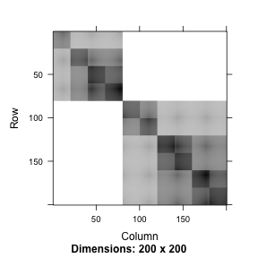
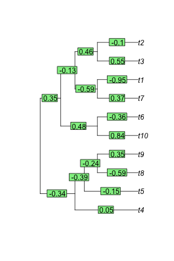
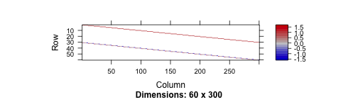
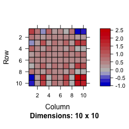

lme4ord (l-m-e-ford)
====================


Mixed-effects models for community ecologists.  See the currently
evolving [mission statement](https://github.com/stevencarlislewalker/lme4ord/issues/1).

This package is not at all stable.


```r
library(Matrix)
library(lme4ord)
library(plotrix)
library(minqa)
library(ape)
library(lme4)
library(lme4pureR)
library(multitable)
library(pryr)
library(reo)
```

#### phylogenetic generalized linear mixed models!

The idea is to be able to fit a `glmer` model where there is a known
(e.g. phylogenetic) correlation structure over the levels of the
random effects grouping factors.  In the example below, we simulate
data and fit such a model.  The call will look like this.


```r
glmerc(y ~ x * z + (x | species), data,
       covList = list(species = Vphy),
       family = binomial)
```

Here `y` is a 0-1 vector indicating which species were present at
which sites.  `x` and `z` are environmental variables (over the sites)
and traits (over the species).  `Vphy` is a phylogenetic correlation
matrix, which is tagged by `species` because this corresponds to a
particular grouping factor in the model formula.  The size of `Vphy`
therefore must equal the number of levels of `species`.

In `glmer` this model formula would fit a two-by-two covariance matrix
over the slope and intercept implied by the random effect term.  This
same covariance matrix is repeated over each of the levels of the
grouping factor, `species`.  Therefore, the full random effects
covariance matrix can be viewed as a Kronecker product between this
two-by-two matrix and an identity matrix of size given by the number
of levels.  In `glmerc`, this identity matrix is simply replaced by
what is given in `covList` for the relevant grouping factor, which in
this case is the phylogenetic covariance matrix, `Vphy`.

##### Simulations

Begin with initial simulations of a sites-by-species binary response
matrix, `y`, environmental variable, `x`, and trait `z`.
stronger correlations between `y` and `x` will be added below.

```r
set.seed(10)
n <- 10
m <- 30
dl <- dims_to_vars(data.list(y = 1 * (rmat(n, m) > 0),
                             x = rnorm(n), z = rnorm(m),
                             dimids = c("sites", "species")))
df <- as.data.frame(dl)
head(df)
```

```
##       y          x         z sites species
## 01.01 1  1.5025446 0.5115965    01      01
## 02.01 0  0.5904095 0.5115965    02      01
## 03.01 0 -0.6306855 0.5115965    03      01
## 04.01 0  0.7923495 0.5115965    04      01
## 05.01 1  0.1253846 0.5115965    05      01
## 06.01 1  0.3227550 0.5115965    06      01
```

Make up some silly phylogeny.


```r
phy <- rtree(n = m)
phy <- compute.brlen(phy, method = "Grafen", power = 0.5)
```

and estimate a phylogenetic covariance matrix, standardized to unit determinant.


```r
Vphy <- stanCov(vcv(phy))
dimnames(Vphy) <- rep(list(1:m), 2)
```

Here's the phylogeny (forget the species names) and the associated covariance matrix


```r
plot(phy)
```

 

```r
image(as(Vphy, "sparseMatrix"))
```

 

Put the covariance matrix in a list, for model-input purposes -- the
idea is that there might be other covariance matrix (e.g. a spatial
one say).  It is important that the list element gets the name
`species` because this is the name of the grouping factor used in the
model formula below.


```r
covList <- list(species = Vphy)
```

Here is the cool part ... a formula interface.  This model has a fixed
interaction between the environment and the trait (with intercept and
main effects too), a random environmental slope and intercept with
phylogenetic correlations across species.  However, the phylogenetic
nature of the covariances is not set in the formula, but rather as an
argument to the `glmercFormula` function below, which will form the
formula parsing module of a pglmer function.

```r
form <- y ~ x*z + (x | species)
parsedForm <- glmercFormula(form, df, covList = covList)
```

Set the covariance parameters to something more interesting (i.e. with
a covariance between the slope and intercept).

```r
covarSim <- c(0.5, -0.2, 0.5)
parsedForm <- within(parsedForm, Lambdat@x[] <- mapToCovFact(covarSim))
```
Update the simulations to reflect the new structure.

```r
X <- model.matrix(nobars(form), df) # fixed effects design matrix
Z <- t(parsedForm$Lambdat %*% parsedForm$Zt) # random effects design
                                             # matrix with
                                             # phylogenetic
                                             # covariances
fixefSim <- rnorm(ncol(X)) # fixed effects
u <- rnorm(ncol(Z)) # whitened random effects
p <- plogis(as.numeric(X %*% fixefSim + Z %*% u)) # probability of observation
dl$y <- rbinom(nrow(df), 1, p) # presence-absence data
df <- as.data.frame(dl) # reconstruct the data frame with new
                        # structured response
```

Now we look at the new structure.  Here's the Cholesky factor of the
species covariance, and the covariance itself.

```{r, fig.width=3, fig.height=3} image(parsedForm$Lambdat)
image(crossprod(parsedForm$Lambdat)) ``` The big four blocks represent
the 2-by-2 covariance between intercept and slope.  The covariances
within these blocks represent phylogenetic covariance.  the pattern
here is more closely related species have more similar intercepts and
slopes (red blocks on the diagonal) but more closely related species
also have stronger negative correlations between slope and intercept
(blue blocks on off diagonal).

Here's the transposed random effects model matrix.  Those are 1's for
the intercepts in the first 30 rows and the environmental variable in
the second 30.


```r
image(parsedForm$Zt)
```

 

Here's the full covariance matrix (the large scale blocks reflect
phylogenetic correlations and the patterns within each block are due
to the environmental variable).


```r
image(fullCov <- t(parsedForm$Zt) %*% crossprod(parsedForm$Lambdat) %*% parsedForm$Zt)
```

 

Here is the observed occurrence pattern of species among sites.


```r
color2D.matplot(dl$y, xlab = "species", ylab = "sites", main = "abundance")
```

 

##### Fit the model


```r
(mod <- glmerc(form, df, covMat = covMat))
```

```
## npt = 9 , n =  7 
## rhobeg =  0.2 , rhoend =  2e-07 
##    0.020:  15:      343.673; 1.20159 -0.139508 0.483041 -0.933195 0.582633 0.0508191 0.549206 
##   0.0020:  42:      333.153; 1.15618 -0.102176 0.262600 -1.03684 0.0105459 0.439994 0.863897 
##  0.00020:  76:      333.083; 1.14676 -0.116070 0.164472 -1.00478 0.0258033 0.445324 0.839599 
##  2.0e-05: 111:      333.083; 1.14677 -0.119141 0.156695 -1.00379 0.0278167 0.444258 0.838293 
##  2.0e-06: 143:      333.083; 1.14698 -0.119098 0.156374 -1.00405 0.0278116 0.444394 0.838391 
##  2.0e-07: 174:      333.083; 1.14704 -0.119139 0.156302 -1.00409 0.0278226 0.444432 0.838413 
## At return
## 194:     333.08262:  1.14705 -0.119142 0.156301 -1.00409 0.0278254 0.444433 0.838415
```

```
## 
## Generalized linear mixed model
## with covariance amongst grouping factor levels
## ----------------------------------------------
## 
## Fixed effects
## -------------
## 
##                Estimate Std. Error
## (Intercept) -1.00408875  0.2808641
## x            0.02782545  0.1957038
## z            0.44443258  0.2719587
## x:z          0.83841455  0.2093839
## 
## 
## Random effects (co)variance
## ---------------------------
## 
## $species
##             (Intercept)           x
## (Intercept)   1.3157135 -0.13666152
## x            -0.1366615  0.03862486
```

and compare with the true parameter values.


```r
cbind(estimated = mod$opt$par, # estimated parameters
      true = c(covar = covarSim, fixef = fixefSim)) # true parameters
```

```
##          estimated        true
## covar1  1.14704553  0.50000000
## covar2 -0.11914219 -0.20000000
## covar3  0.15630098  0.50000000
## fixef1 -1.00408875 -1.13324675
## fixef2  0.02782545  0.06607030
## fixef3  0.44443258  0.03799977
## fixef4  0.83841455  0.92106475
```

Looks great!  At least in this case.

#### mixed effects ordination!


```r
data(fish)
data(limn)
Y <- as.matrix(fish)
n <- nrow(Y)
m <- ncol(Y)
x <- as.vector(scale(limn$pH))
dl <- data.list(Y = t(Y), x = x,
                dimids = c("species", "sites"))
summary(dl)
```

```
##            Y     x
## species TRUE FALSE
## sites   TRUE  TRUE
```

Not done!
