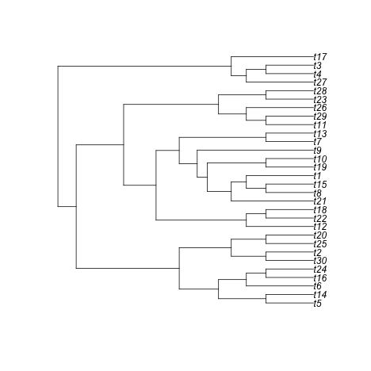
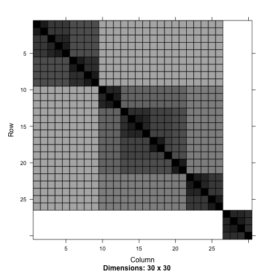

lme4ord (l-m-e-ford)
====================


Mixed-effects models for community ecologists.  See the currently
evolving [mission statement](https://github.com/stevencarlislewalker/lme4ord/issues/1).

This package is not at all stable.


```r
library(Matrix)
library(lme4ord)
library(plotrix)
library(minqa)
library(ape)
library(lme4)
library(lme4pureR)
library(multitable)
library(pryr)
library(reo)
```

#### Edge-based phylogenetic GLMMs

Acknowledgements:  Ben Bolker, Jarrod Hadfield, and Guillaume Blanchet
have provided extremely useful discussions.

Here's some new stuff that I'm excited about, mostly because it seems
to solve a huge computational cost problem with Ives and Helmus style
PGLMMs, and just because it is interesting.  The idea is to avoid all
of the computationally expensive linear algebra involved when dealing
with dense phylogenetic covariance matrices.  Instead, from an idea
Ben and I had after a discussion with Jerrod Hadfield, we have a
random effect for each edge.  These effects act on all species that
descend from the particular edge in question.

Here's a simple simulated example with twenty sites and ten species,
but there is absolutely no problem with scaling this up (that's one of
the main points).  This example also shows off the nice modularized
fitting in `lme4ord`.


```r
td <- simTestPhyloDat(10, n = 20, m = 10, power = 0.4)
```

```
## Error: argument "strList" is missing, with no default
```

```r
color2D.matplot(td$dl$y, xlab = "species", ylab = "sites",
                main = "Occurrence")
```

```
## Error in color2D.matplot(td$dl$y, xlab = "species", ylab = "sites", main = "Occurrence"): object 'td' not found
```

```r
plot(td$ph)
```

```
## Error in plot(td$ph): object 'td' not found
```

```r
edgelabels()
```

```
## Error in get("last_plot.phylo", envir = .PlotPhyloEnv): object 'last_plot.phylo' not found
```

We find an indicator matrix giving the relationships between the edges
(plotted above on the phylogeny) and the tips (also plotted).


```r
(indMat <- edgeTipIndicator(td$ph))
```

```
## Error in edgeTipIndicator(td$ph): object 'td' not found
```

Now we add this matrix to the data.


```r
dummy <- as.data.frame(t(indMat))
```

```
## Error in t(indMat): error in evaluating the argument 'x' in selecting a method for function 't': Error: object 'indMat' not found
```

```r
td$dl <- td$dl + variableGroup(dummy, "species")
```

```
## Error in eval(expr, envir, enclos): object 'td' not found
```

```r
edgeNms <- names(dummy)
df <- as.data.frame(td$dl)
```

```
## Error in as.data.frame(td$dl): object 'td' not found
```

Now construct objects for fitting the mixed model.


```r
Z <- model.matrix(as.formula(paste("~ 0 + ", paste(edgeNms, collapse = " + "))), df)
```

```
## Error in parse(text = x): <text>:2:0: unexpected end of input
## 1: ~ 0 +  
##    ^
```

```r
X <- model.matrix(~ 1, df)
```

```
## Error in terms.formula(object, data = data): 'data' argument is of the wrong type
```

```r
y <- model.response(model.frame(y ~ 1, df))
```

```
## Error in terms.formula(formula, data = data): 'data' argument is of the wrong type
```

```r
n <- nrow(df)
p <- ncol(X)
```

```
## Error in ncol(X): object 'X' not found
```

```r
q <- ncol(Z)
```

```
## Error in ncol(Z): object 'Z' not found
```

```r
mapToCovFact <- local({
    q <- q
    function(covar) rep(covar, q)
})
```

With these objects we may use the `mkGeneralGlmerDevfun` function in
`lme4ord`.


```r
dfun <- mkGeneralGlmerDevfun(y = y, X = X,
                             Zt = as(t(Z), "sparseMatrix"),
                             Lambdat = sparseMatrix(i = 1:q, j = 1:q, x = 1),
                             weights = rep(1, n), offset = rep(0, n),
                             initPars = c(1, 0),
                             parInds = list(covar = 1, fixef = 2),
                             mapToCovFact = mapToCovFact,
                             mapToModMat = NULL)
```

```
## Error in 1:q: NA/NaN argument
```

Optimizing the resulting deviance function gives,


```r
opt <- optim(c(1, 0), dfun, lower = c(0, -Inf), method = "L-BFGS-B")
```

```
## Error in (function (par) : object 'dfun' not found
```

```r
dfun(opt$par)
```

```
## Error in eval(expr, envir, enclos): could not find function "dfun"
```

```r
opt$par
```

```
## Error in eval(expr, envir, enclos): object 'opt' not found
```

And here are some plots of the output, including the full covariance
matrix for the entire system and the phylogeny with the estimated edge
effects.


```r
rho <- environment(dfun)
```

```
## Error in environment(dfun): object 'dfun' not found
```

```r
with(rho$pp, image(crossprod(Lambdat %*% Zt)))
```

```
## Error in with(rho$pp, image(crossprod(Lambdat %*% Zt))): object 'rho' not found
```


```r
plot(td$ph)
```

```
## Error in plot(td$ph): object 'td' not found
```

```r
edgelabels(round(rho$pp$b(1), 2), cex = 1)
```

```
## Error in get("last_plot.phylo", envir = .PlotPhyloEnv): object 'last_plot.phylo' not found
```

This plot gives the estimated phylogenetic effects on community
structure on each branch.  The link-scale effects for each species are
simply the sums of the values on the branches leading to them.

And it scales well!  Here's an example with 100 sites and 500 species.


```
## Error: argument "strList" is missing, with no default
```

```
## Error in edgeTipIndicator(td$ph): object 'td' not found
```

```
## Error in t(indMat): error in evaluating the argument 'x' in selecting a method for function 't': Error: object 'indMat' not found
```

```
## Error in eval(expr, envir, enclos): object 'td' not found
```

```
## Error in as.data.frame(td$dl): object 'td' not found
```

```
## Error in parse(text = x): <text>:2:0: unexpected end of input
## 1: ~ 0 +  
##    ^
```

```
## Error in terms.formula(object, data = data): 'data' argument is of the wrong type
```

```
## Error in terms.formula(formula, data = data): 'data' argument is of the wrong type
```

```
## Error in ncol(X): object 'X' not found
```

```
## Error in ncol(Z): object 'Z' not found
```

```
## Error in 1:q: NA/NaN argument
```

```r
system.time(opt <- optim(c(1, 0), dfun, lower = c(0, -Inf), method = "L-BFGS-B"))
```

```
## Error in (function (par) : object 'dfun' not found
```

```
## Timing stopped at: 0.001 0 0
```

`glmerc` (below) can't do that!  I think the reason for the speed is
the following sparsity pattern, which gives the numbers of species
'shared' by pairs of edges.


```r
image(as(tcrossprod(indMat), "sparseMatrix"))
```

```
## Error in image(as(tcrossprod(indMat), "sparseMatrix")): error in evaluating the argument 'x' in selecting a method for function 'image': Error in tcrossprod(indMat) : 
##   error in evaluating the argument 'x' in selecting a method for function 'tcrossprod': Error: object 'indMat' not found
## Calls: as -> .class1 -> tcrossprod
```

#### phylogenetic generalized linear mixed models!

Acknowledgements:  Ben Bolker, Tony Ives, and Guillaume Blanchet have 
provided invaluable discussions, advice, and encouragement.  Ben Bolker
has also provided valuable money.

The idea is to be able to fit a `glmer` model where there is a known
(e.g. phylogenetic) correlation structure over the levels of the
random effects grouping factors.  The function `glmerc` (for `glmer`
with known *C*ovariance over levels) can be used for this purpose.  In
terms of phylogenetic theory, the `glmerc` function essentially fits
the
[almost creationist](http://www.carlboettiger.info/2013/10/11/is-it-time-to-retire-pagels-lambda.html)
Pagel's lambda model within a generalized linear mixed model
framework.  Technically, Pagel's lambda is much easier to work with in
`lme4` because it doesn't require an expensive Cholesky decomposition
at each evaluation of the deviance function, whereas other models do
require this.  Nevertheless, the ultimate plan is to extend the range
of models, and the modular structure of `lme4` and `lme4ord` make this
[fairly easy to experiment with](http://stackoverflow.com/questions/19327088/reproducing-results-from-previous-answer-is-not-working-due-to-using-new-version/19382162#19382162).
`lme4ord` is still very much in the development stage however and I
would love to get feedback.

In the example below, we simulate data and fit such a model.  The call will look like this.


```r
glmerc(y ~ x * z + (x | species), data,
       covList = list(species = Vphy),
       family = binomial)
```

Here `y` is a 0-1 vector indicating which species were present at
which sites.  `x` and `z` are environmental variables (over the sites)
and traits (over the species).  `Vphy` is a phylogenetic covariance
matrix, which is tagged by `species` because this corresponds to a
particular grouping factor in the model formula.  The size of `Vphy`
therefore must equal the number of levels of `species`.

In `glmer` this model formula would fit a two-by-two covariance matrix
over the slope and intercept implied by the random effect term.  This
same covariance matrix is repeated over each of the levels of the
grouping factor, `species`.  Therefore, the full random effects
covariance matrix can be viewed as a Kronecker product between this
two-by-two matrix and an identity matrix of size given by the number
of levels.  In `glmerc`, this identity matrix is simply replaced by
what is given in `covList` for the relevant grouping factor, which in
this case is the phylogenetic covariance matrix, `Vphy`.

##### Simulations

Begin with initial simulations of a sites-by-species binary response
matrix, `y`, environmental variable, `x`, and trait `z`.
More interesting patterns between `y`, `x`, and `z` will be added below.

```r
set.seed(10)
n <- 10
m <- 30
dl <- dims_to_vars(data.list(y = 1 * (matrix(rnorm(n * m), n, m) > 0),
                             x = rnorm(n), z = rnorm(m),
                             dimids = c("sites", "species")))
df <- as.data.frame(dl)
head(df)
```

```
##       y          x         z sites species
## 01.01 1  1.5025446 0.5115965    01      01
## 02.01 0  0.5904095 0.5115965    02      01
## 03.01 0 -0.6306855 0.5115965    03      01
## 04.01 0  0.7923495 0.5115965    04      01
## 05.01 1  0.1253846 0.5115965    05      01
## 06.01 1  0.3227550 0.5115965    06      01
```

Make up some silly phylogeny.


```r
phy <- rtree(n = m)
phy <- compute.brlen(phy, method = "Grafen", power = 0.5)
```

and estimate a phylogenetic covariance matrix, standardized to unit determinant.


```r
Vphy <- stanCov(vcv(phy))
dimnames(Vphy) <- rep(list(1:m), 2)
```

Here's the phylogeny (forget the species names) and the associated covariance matrix


```r
plot(phy)
```

 

```r
image(as(Vphy, "sparseMatrix"))
```

 

Put the covariance matrix in a list, for model-input purposes -- the
idea is that there might be other covariance matrices (e.g. a spatial
one say).  It is important that the list element gets the name
`species` because this is the name of the grouping factor used in the
model formula below.


```r
covList <- list(species = Vphy)
```

There is a formula interface.  This model has a fixed interaction
between the environment and the trait (with intercept and main effects
too), a random environmental slope and intercept with phylogenetic
correlations across species.  However, the phylogenetic nature of the
covariances is not set in the formula, but rather as an argument to
the `glmercFormula` function below, which makes up the formula parsing
module of the `glmerc` function.


```r
form <- y ~ x * z + (x | species)
parsedForm <- glmercFormula(form, df, covList = covList)
```

```
## Error: argument "strList" is missing, with no default
```

Set the covariance parameters to something more interesting (i.e. with
a covariance between the slope and intercept).

```r
covarSim <- c(0.5, -0.2, 0.5)
parsedForm <- within(parsedForm, Lambdat@x[] <- mapToCovFact(covarSim))
```

```
## Error in within(parsedForm, Lambdat@x[] <- mapToCovFact(covarSim)): object 'parsedForm' not found
```
Update the simulations to reflect the new structure.

```r
X <- model.matrix(nobars(form), df) # fixed effects design matrix
Z <- t(parsedForm$Lambdat %*% parsedForm$Zt) # random effects design
```

```
## Error in t(parsedForm$Lambdat %*% parsedForm$Zt): error in evaluating the argument 'x' in selecting a method for function 't': Error: object 'parsedForm' not found
```

```r
                                             # matrix with
                                             # phylogenetic
                                             # covariances
fixefSim <- rnorm(ncol(X)) # fixed effects
u <- rnorm(ncol(Z)) # whitened random effects
```

```
## Error in ncol(Z): object 'Z' not found
```

```r
p <- plogis(as.numeric(X %*% fixefSim + Z %*% u)) # probability of observation
```

```
## Error in plogis(as.numeric(X %*% fixefSim + Z %*% u)): object 'Z' not found
```

```r
dl$y <- rbinom(nrow(df), 1, p) # presence-absence data
```

```
## Error in rbinom(nrow(df), 1, p): object 'p' not found
```

```r
df <- as.data.frame(dl) # reconstruct the data frame with new
                        # structured response
```

Now we look at the new structure.  Here's the Cholesky factor of the
species covariance, and the covariance itself.


```r
image(parsedForm$Lambdat)
```

```
## Error in image(parsedForm$Lambdat): error in evaluating the argument 'x' in selecting a method for function 'image': Error: object 'parsedForm' not found
```

```r
image(crossprod(parsedForm$Lambdat))
```

```
## Error in image(crossprod(parsedForm$Lambdat)): error in evaluating the argument 'x' in selecting a method for function 'image': Error in crossprod(parsedForm$Lambdat) : 
##   error in evaluating the argument 'x' in selecting a method for function 'crossprod': Error: object 'parsedForm' not found
```

The big four blocks represent the 2-by-2 covariance between intercept
and slope.  The covariances within these blocks represent phylogenetic
covariance.  the pattern here is more closely related species have
more similar intercepts and slopes (red blocks on the diagonal) but
more closely related species also have stronger negative correlations
between slope and intercept (blue blocks on off diagonal).

Here's the transposed random effects model matrix.  Those are 1's for
the intercepts in the first 30 rows and the environmental variable in
the second 30.


```r
image(parsedForm$Zt)
```

```
## Error in image(parsedForm$Zt): error in evaluating the argument 'x' in selecting a method for function 'image': Error: object 'parsedForm' not found
```

Here's the full covariance matrix (the large scale blocks reflect
phylogenetic correlations and the patterns within each block are due
to the environmental variable).


```r
image(fullCov <- t(parsedForm$Zt) %*% crossprod(parsedForm$Lambdat) %*% parsedForm$Zt)
```

```
## Error in image(fullCov <- t(parsedForm$Zt) %*% crossprod(parsedForm$Lambdat) %*% : error in evaluating the argument 'x' in selecting a method for function 'image': Error in t(parsedForm$Zt) : 
##   error in evaluating the argument 'x' in selecting a method for function 't': Error: object 'parsedForm' not found
```

Here is the observed occurrence pattern of species among sites.


```r
color2D.matplot(dl$y, xlab = "species", ylab = "sites", main = "abundance")
```

 

##### Fit the model


```r
(mod <- glmerc(form, df, covList = covList))
```

```
## Error: argument "strList" is missing, with no default
```

and compare with the true parameter values.


```r
cbind(estimated = mod$opt$par, # estimated parameters
      true = c(covar = covarSim, fixef = fixefSim)) # true parameters
```

```
## Error in cbind(estimated = mod$opt$par, true = c(covar = covarSim, fixef = fixefSim)): object 'mod' not found
```

Looks great!  At least in this case.

#### mixed effects ordination!


```r
data(fish)
data(limn)
Y <- as.matrix(fish)
n <- nrow(Y)
m <- ncol(Y)
x <- as.vector(scale(limn$pH))
dl <- data.list(Y = t(Y), x = x,
                dimids = c("species", "sites"))
summary(dl)
```

```
##            Y     x
## species TRUE FALSE
## sites   TRUE  TRUE
```

Not done!

#### spatial models

No example yet, but the idea is to put a spatial covariance matrix
over the levels of a spatial grouping factor.  For example, you might
do something like this,

```r
glmerc(y ~ x + (x | sites), covList = list(sites = spatialCovMat))
```
