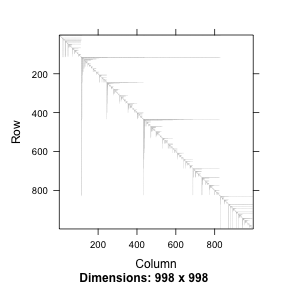
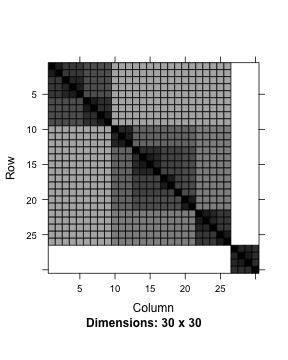

lme4ord (l-m-e-ford)
====================


Mixed-effects models for community ecologists.  See the currently
evolving [mission statement](https://github.com/stevencarlislewalker/lme4ord/issues/1).

This package is not at all stable.


```r
library(Matrix)
library(lme4ord)
library(plotrix)
library(minqa)
library(ape)
library(lme4)
library(lme4pureR)
library(multitable)
library(pryr)
library(reo)
```

#### phylogenetic generalized linear mixed models!

Begin with initial simulations of a sites-by-species binary response
matrix, `y`, environmental variable, `x`, and trait `z`.
stronger correlations between `y` and `x` will be added below.

```r
set.seed(10)
n <- 10
m <- 30
dl <- dims_to_vars(data.list(y = 1 * (rmat(n, m) > 0),
                             x = rnorm(n), z = rnorm(m),
                             dimids = c("sites", "species")))
df <- as.data.frame(dl)
head(df)
```

```
##       y          x         z sites species
## 01.01 1  1.5025446 0.5115965    01      01
## 02.01 0  0.5904095 0.5115965    02      01
## 03.01 0 -0.6306855 0.5115965    03      01
## 04.01 0  0.7923495 0.5115965    04      01
## 05.01 1  0.1253846 0.5115965    05      01
## 06.01 1  0.3227550 0.5115965    06      01
```

Make up some silly phylogeny.

```r
phy <- rtree(n = m)
phy <- compute.brlen(phy, method = "Grafen", power = 0.5)
```
and estimate a phylogenetic covariance matrix, standardized to unit determinant.

```r
Vphy <- stanCov(vcv(phy))
dimnames(Vphy) <- rep(list(1:m), 2)
```
Here's the phylogeny (forget the species names) and the associated covariance matrix

```r
plot(phy)
```

 

```r
image(as(Vphy, "sparseMatrix"))
```

 
Put the covariance matrix in a list, for model-input purposes -- the
idea is that there might be other covariance matrix (e.g. a spatial
one say).  It is important that the list element gets the name
`species` because this is the name of the grouping factor used in the
model formula below.

```r
covList <- list(species = Vphy)
```

Here is the cool part ... a formula interface.  This model has a fixed
interaction between the environment and the trait (with intercept and
main effects too), a random environmental slope and intercept with
phylogenetic correlations across species.  However, the phylogenetic
nature of the covariances is not set in the formula, but rather as an
argument to the `levelsCovFormula` function below, which will form the
formula parsing module of a pglmer function.

```r
form <- y ~ x*z + (x | species)
parsedForm <- levelsCovFormula(form, df, covList = covList)
```

```
## Error in eval(expr, envir, enclos): could not find function "levelsCovFormula"
```

Set the covariance parameters to something more interesting (i.e. with
a covariance between the slope and intercept).

```r
covarSim <- c(0.5, -0.2, 0.5)
parsedForm <- within(parsedForm, Lambdat@x[] <- mapToCovFact(covarSim))
```

```
## Error in within(parsedForm, Lambdat@x[] <- mapToCovFact(covarSim)): object 'parsedForm' not found
```
Update the simulations to reflect the new structure.

```r
X <- model.matrix(nobars(form), df) # fixed effects design matrix
Z <- t(parsedForm$Lambdat %*% parsedForm$Zt) # random effects design
```

```
## Error in t(parsedForm$Lambdat %*% parsedForm$Zt): error in evaluating the argument 'x' in selecting a method for function 't': Error: object 'parsedForm' not found
```

```r
                                             # matrix with
                                             # phylogenetic
                                             # covariances
fixefSim <- rnorm(ncol(X)) # fixed effects
u <- rnorm(ncol(Z)) # whitened random effects
```

```
## Error in ncol(Z): object 'Z' not found
```

```r
p <- plogis(as.numeric(X %*% fixefSim + Z %*% u)) # probability of observation
```

```
## Error in plogis(as.numeric(X %*% fixefSim + Z %*% u)): object 'Z' not found
```

```r
dl$y <- rbinom(nrow(df), 1, p) # presence-absence data
```

```
## Error in rbinom(nrow(df), 1, p): object 'p' not found
```

```r
df <- as.data.frame(dl) # reconstruct the data frame with new
                        # structured response
```
Now we look at the new structure.  Here's the Cholesky factor of the species covariance, and the covariance itself.

```r
image(parsedForm$Lambdat)
```

```
## Error in image(parsedForm$Lambdat): error in evaluating the argument 'x' in selecting a method for function 'image': Error: object 'parsedForm' not found
```

```r
image(crossprod(parsedForm$Lambdat))
```

```
## Error in image(crossprod(parsedForm$Lambdat)): error in evaluating the argument 'x' in selecting a method for function 'image': Error in crossprod(parsedForm$Lambdat) : 
##   error in evaluating the argument 'x' in selecting a method for function 'crossprod': Error: object 'parsedForm' not found
```
The big four blocks represent the 2-by-2 covariance between intercept
and slope.  The covariances within these blocks represent phylogenetic
covariance.  the pattern here is more closely related species have
more similar intercepts and slopes (red blocks on the diagonal) but
more closely related species also have stronger negative correlations
between slope and intercept (blue blocks on off diagonal).

Here's the transposed random effects model matrix.  Those are 1's for
the intercepts in the first 30 rows and the environmental variable in
the second 30.

```r
image(parsedForm$Zt)
```

```
## Error in image(parsedForm$Zt): error in evaluating the argument 'x' in selecting a method for function 'image': Error: object 'parsedForm' not found
```

Here's the full covariance matrix (the large scale blocks reflect
phylogenetic correlations and the patterns within each block are due
to the environmental variable).

```r
image(fullCov <- t(parsedForm$Zt) %*% crossprod(parsedForm$Lambdat) %*% parsedForm$Zt)
```

```
## Error in image(fullCov <- t(parsedForm$Zt) %*% crossprod(parsedForm$Lambdat) %*% : error in evaluating the argument 'x' in selecting a method for function 'image': Error in t(parsedForm$Zt) : 
##   error in evaluating the argument 'x' in selecting a method for function 't': Error: object 'parsedForm' not found
```
Here's a closeup of one of the blocks

```r
image(fullCov[1:10, 1:10])
```

```
## Error in image(fullCov[1:10, 1:10]): error in evaluating the argument 'x' in selecting a method for function 'image': Error: object 'fullCov' not found
```
A potential problem is that this block is singular.

```r
eigen(fullCov[1:10, 1:10])$values
```

```
## Error in as.matrix(x): object 'fullCov' not found
```
In fact the rank of the full 300 by 300 matrix is only 60 = 30 species
times 2 model matrix columns.

```r
rankMatrix(fullCov)[1]
```

```
## Error in stopifnot(length(d <- dim(x)) == 2): object 'fullCov' not found
```
But then again so is the standard non-phylogenetic `glmer` model.

```r
gm <- glmer(form, df, binomial)
with(getME(gm, c("Zt", "Lambdat")), {
    covMatGm <- t(Zt) %*% crossprod(Lambdat) %*% Zt
    print(rankMatrix(covMatGm)[1])
    dim(covMatGm)
})
```

```
## [1] 30
```

```
## [1] 300 300
```
The distribution of underlying probabilities of occurrence looks OK.

```r
hist(p)
```

```
## Error in hist(p): object 'p' not found
```
Here is the observed occurrence pattern.

```r
color2D.matplot(dl$y, xlab = "species", ylab = "sites", main = "abundance")
```

 


```r
mod <- glmerc(form, df, covMat = covMat)
```

```
## npt = 9 , n =  7 
## rhobeg =  0.2 , rhoend =  2e-07 
##    0.020:  13:      416.215;0.458710 -0.200171 0.621835 -0.104852 -0.0693831 -0.106557 0.181020 
##   0.0020:  47:      410.103;0.511513 -0.278630 0.0763083 -0.0252949 -0.0396708 0.00903895 0.169824 
##  0.00020:  77:      410.025;0.514705 -0.302518  0.00000 -0.000759701 -0.0461109 -0.00429556 0.179337 
##  2.0e-05:  98:      410.024;0.512559 -0.303636  0.00000 -0.00238239 -0.0465206 -0.00378935 0.180255 
##  2.0e-06: 111:      410.024;0.512597 -0.303755  0.00000 -0.00236715 -0.0464696 -0.00378699 0.180302 
##  2.0e-07: 127:      410.024;0.512597 -0.303744  0.00000 -0.00236739 -0.0464717 -0.00377934 0.180295 
## At return
## 148:     410.02430: 0.512598 -0.303743 3.56407e-07 -0.00236752 -0.0464721 -0.00377842 0.180294
```

```
## Error in glmerc(form, df, covMat = covMat): object 'y' not found
```
and compare with the true parameter values.

```r
cbind(estimated = mod$opt$par, # estimated parameters
      true = c(covar = covarSim, fixef = fixefSim)) # true parameters
```

```
## Error in cbind(estimated = mod$opt$par, true = c(covar = covarSim, fixef = fixefSim)): object 'mod' not found
```
Looks great!  At least in this case.

#### mixed effects ordination!


```r
data(fish)
data(limn)
Y <- as.matrix(fish)
## Y <- Y[, colSums(Y) > 1]
n <- nrow(Y)
m <- ncol(Y)
x <- as.vector(scale(limn$pH))
dl <- data.list(Y = t(Y), x = x,
                dimids = c("species", "sites"))
summary(dl)
```

```
##            Y     x
## species TRUE FALSE
## sites   TRUE  TRUE
```

Not done!
