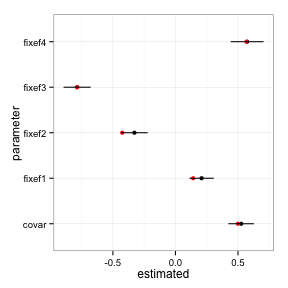
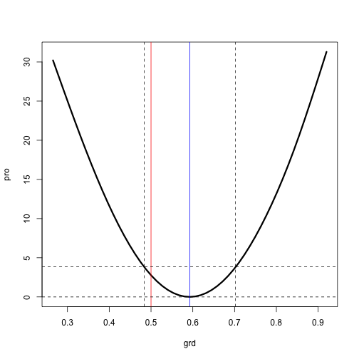

We simulate some data.

```r
set.seed(1)
n <- 10 # 100
m <- 500 # 500
dl <- dims_to_vars(data.list(y = 1 * (matrix(rnorm(n * m), n, m) > 0),
                             x = rnorm(n), z = rnorm(m),
                             dimids = c("sites", "species")))
df <- as.data.frame(dl)
phy <- rtree(n = m)
phy <- compute.brlen(phy, method = "Grafen", power = 0.1)
Vphy <- stanCov(vcv(phy))
dimnames(Vphy) <- rep(list(1:m), 2)
covList <- list(species = Vphy)
form <- y ~ x*z + (x | species)
parsedForm <- glmercFormula(form, df, covList = covList)
covarSim <- c(0.5, -0.2, 0.5)
parsedForm <- within(parsedForm, Lambdat@x[] <- mapToCovFact(covarSim))
X <- model.matrix(nobars(form), df) # fixed effects design matrix
Z <- t(parsedForm$Lambdat %*% parsedForm$Zt) # random effects design
                                             # matrix with
                                             # phylogenetic
                                             # covariances
fixefSim <- rnorm(ncol(X)) # fixed effects
u <- rnorm(ncol(Z)) # whitened random effects
p <- plogis(as.numeric(X %*% fixefSim + Z %*% u)) # probability of observation
dl$y <- rbinom(nrow(df), 1, p) # presence-absence data
df <- as.data.frame(dl) # reconstruct the data frame with new
                        # structured response
```

Fit the generating model to the simulated data.

```r
mod <- glmerc(form, df, covMat = covMat,
              optControl = list(iprint = 0L, maxfun = 500))
```

Compute the Wald confidence intervals two ways.

```r
centDfun <- function(par) mod$dfun(par) - mod$opt$fval
getCI <- function(H, expandFac = 1) {
    ans <- sweep(outer(sqrt(diag(solve(0.5*H))), expandFac * 1.96 * c(-1, 1)),
                 1, mod$opt$par, "+")
    colnames(ans) <- c("lower", "upper")
    ans
}
hh <- lme4:::deriv12(centDfun, mod$opt$par)$Hessian
ci <- getCI(hh)
hhRich <- hessian(centDfun, mod$opt$par)
ciRich <- getCI(hhRich)
```


```r
params <- as.data.frame(cbind(estimated = mod$opt$par,
                              true = c(covar = covarSim, fixef = fixefSim),
                              ci))
params$parameter <- rownames(params)
ggplot(params) +
    geom_point(aes(estimated, parameter)) +
    geom_point(aes(true, parameter), col = "red") +
    geom_segment(aes(lower, parameter, xend = upper, yend = parameter))
```

 


Compute the deviance profile for a particular parameter.

```r
pfun <- mkPfun(whichPar <- 1)
expFac <- 1 * apply(ci, 1, diff)
grd <- seq(-expFac[whichPar] + ci[whichPar, 1],
            expFac[whichPar] + ci[whichPar, 2], length = 10)
pro <- sapply(grd, pfun)
```

Plot the results

```r
plot(interpSpline(grd, pro), lwd = 3) # profiled deviance
abline(v = c(covarSim, fixefSim)[whichPar], col = "red") # true value
abline(v = mod$opt$par[whichPar], col = "blue") # mle
abline(h = c(0, qchisq(0.95, 1)), lty = 2) # approximate LR confidence limits on profiled deviance
abline(v = ci[whichPar, ], lty = 2) # approximate walk confidence limits on parameter
```

 
